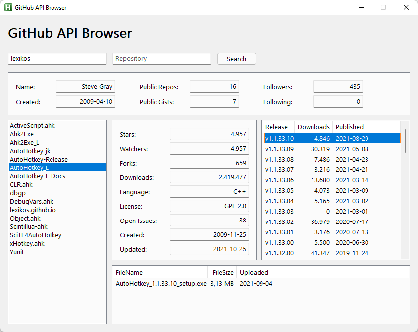
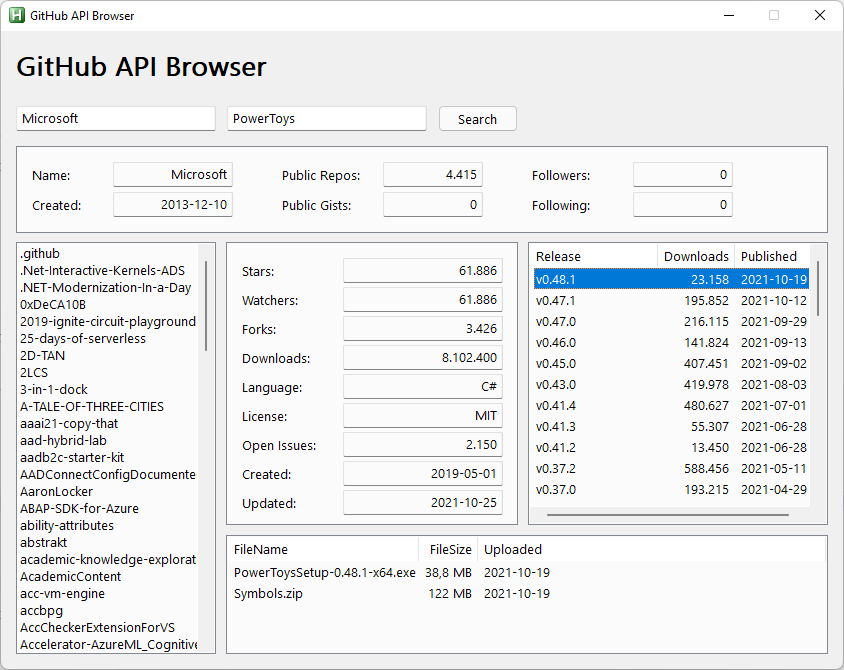

# github-api-browser
 small fun browser to show users and repos stats

## Features
* Shows User stats
* Shows Repos stats
* Shows Releases with Downloads and Filenames

## Examples

## Contributing
* thanks to TheArkive & cocobelgica for Jxon_Load
* thanks to AutoHotkey Community

## Questions / Bugs / Issues
If you notice any kind of bugs or issues, report them on the [AHK Thread](https://www.autohotkey.com/boards/viewtopic.php?t=95898). Same for any kind of questions.

## Copyright and License
[MIT License](LICENSE)

## Donations
[Donations are appreciated if I could help you](https://www.paypal.me/smithz)